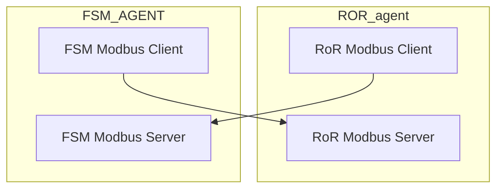

<!--START_SECTION:waka-->

**🐱 Mes données GitHub** 

> 🏆 500 contributions en 2020
 > 
> 📦 0 Bytes utilisés dans le stockage de GitHub 
 > 
> 💼 A choisi d'embaucher
 > 
> 📜 27 référentiels publics
 > 
> 🔑 0 référentiel privé 
 > 
**I'm a Night 🦉** 

<!--END_SECTION:waka-->

---

- hello
- world

